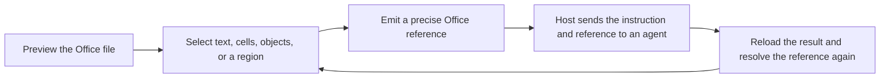

<div align="center">


# Agentic Office UI

**Vue 3 components for human–agent collaboration on Office documents.**

See the document. Point to the right thing. Give the agent a reference it can actually resolve.

English · [简体中文](README.zh-CN.md)

[](https://www.npmjs.com/org/arcships)
[](https://github.com/arcships/agentic-office-ui/actions/workflows/ci.yml)
[](https://github.com/arcships/agentic-office-ui/actions/workflows/release.yml)
[](https://vuejs.org/)
[](LICENSE)
[](https://github.com/arcships/agentic-office-ui/stargazers)

[Get started](docs/guide/getting-started.md) · [Reference selection](docs/guide/reference-selection.md) · [Components](docs/components/README.md) · [API](docs/api/README.md) · [All docs](docs/INDEX.md)

</div>

Agentic Office UI is an open-source component library for displaying DOCX, XLSX, PPTX, and PDF files in the browser and turning a user's visual selection into a precise Office reference.

It sits between a person and an agent. The library owns preview and selection; your application owns the conversation, the agent, the document tool, and the product workflow.

> **Release status:** `0.5.4` is the current npm stable release. The repository is preparing `0.6.0`, which adds the cross-format reference contract, stage-one format adapters, unified Surface events, and region-selection primitives. Screenshot capture, annotation editing, and automatic diff review are not built in yet.

## Why this exists

Agents usually edit Office files through code. People, however, think in paragraphs, cells, charts, slide objects, and visible regions.

That creates two recurring failures:

1. A person cannot see enough of the file while the agent is working to verify what is being changed.
2. Language such as “the table in the lower-right corner of page two” is intuitive for a person but unreliable as an execution target.

Agentic Office UI closes that gap:



The reference says **what the user means**. Natural language says **what the user wants done**.

## What the library gives you

- **Real Office Surfaces** — browser-based viewers and minimal embeddable rendering surfaces for DOCX, XLSX, PPTX, and PDF.
- **Precise references** — document revision, semantic locator, content evidence, normalized geometry, and reliability metadata without dumping the whole UI state into a prompt.
- **User-native selection** — text selection, spreadsheet ranges, visible objects, rows and columns, pages, slides, and fallback regions.
- **Resolution after change** — describe, resolve, and scroll back to a reference after the host reloads a modified file.
- **Controlled primitives** — optional object outlines and region selection, while the host remains free to design its own toolbar, reference tray, chat, or command UI.
- **Framework-neutral core** — shared contracts and pure utilities live in `@arcships/office-interaction`; format adapters live next to their document models.

## Supported formats

| Format | Viewer capabilities | `0.6.0` stage-one references |
|---|---|---|
| DOCX | View, edit, paginate, search, thumbnails, comments, tracked changes, import/export | Exact text, page, and page region |
| XLSX | Sheets, formulas, charts, images, range selection, editing, undo/redo | Worksheet, cell, range, row, column, chart, and sheet region |
| PPTX | Continuous preview, thumbnails, search, object events, playback, transitions, media, fullscreen | Slide, exact object text, visible object, group hierarchy, and slide region |
| PDF | PDFium rendering, page navigation, zoom, rotation, thumbnails, search, glyph selection, download | Exact character range, page, and page region |

Stage one deliberately starts with targets that can be located and validated reliably. Paragraph objects, chart internals, richer document layers, and invisible behaviors such as animations are later selection layers—not claims made by the current release.

## Quick start

Install only the formats you use:

```bash
pnpm add @arcships/vue-docx @arcships/docx-core
pnpm add @arcships/vue-xlsx @arcships/xlsx-core
pnpm add @arcships/vue-pdf
pnpm add @arcships/vue-pptx @arcships/pptx-core
```

Render a complete viewer and import its public stylesheet:

```vue
<script setup lang="ts">
import { PptxViewer } from "@arcships/vue-pptx"
import "@arcships/vue-pptx/style.css"

defineProps<{ file: File | null }>()
</script>

<template>
  <PptxViewer :source="file" mode="browse" height="720px" />
</template>
```

Equivalent high-level entries are available as `DocxViewer`, `XlsxViewer`, and `PdfViewer`.

## Turn a selection into a reference

The unified reference API below belongs to the `0.6.0` source candidate. Once released, applications that import shared types or utilities directly should declare `@arcships/office-interaction` as a direct dependency.

```vue
<script setup lang="ts">
import { shallowRef } from "vue"
import type { OfficeReferenceConfirmEvent } from "@arcships/office-interaction"
import { XlsxSheetSurface, useXlsxViewerController } from "@arcships/vue-xlsx"

const props = defineProps<{ file: ArrayBuffer }>()
const controller = useXlsxViewerController({
  file: props.file,
  fileName: "budget-2026.xlsx",
})
const selectedReference = shallowRef<OfficeReferenceConfirmEvent["reference"]>()

function onReferenceConfirm(event: OfficeReferenceConfirmEvent) {
  selectedReference.value = event.reference
}
</script>

<template>
  <XlsxSheetSurface
    :controller="controller"
    document-id="budget-2026.xlsx"
    selection-mode="content"
    @reference-confirm="onReferenceConfirm"
  />
</template>
```

The Surface emits the reference. Your application decides whether to place it in a chat composer, a command palette, a multi-reference collection, or a structured tool call.

See the [reference selection guide](docs/guide/reference-selection.md) for `content`, `object`, and `region` modes, shared events, exposed methods, and state ownership.

## Choose your integration level

| Goal | Recommended entry |
|---|---|
| Display a file quickly | `DocxViewer`, `XlsxViewer`, `PdfViewer`, `PptxViewer` |
| Build your own toolbar around the document | `DocxDocumentSurface`, `XlsxSheetSurface`, `PdfSurface`, `PptxStage` |
| Build a custom DOCX editor | `DocxEditor` or `useDocxEditor` |
| Build a custom PPTX player | `usePptxDocument` + `usePptxPlayback` + `PptxStage` |
| Work with document models outside Vue | `@arcships/docx-core`, `@arcships/xlsx-core`, `@arcships/pptx-core` |
| Use shared reference types and pure selection logic | `@arcships/office-interaction` |
| Compose your own selection UI | `OfficeObjectOutlineLayer`, `OfficeRegionSelector` from `@arcships/vue-ui` |

## Packages

| Package | Purpose |
|---|---|
| [`@arcships/office-interaction`](packages/office-interaction/README.md) | Cross-format references, runtime validation, candidate navigation, geometry, and transient selection state |
| [`@arcships/docx-core`](packages/docx-core/README.md) | DOCX model, layout, editing commands, reference adapter, and Runtime |
| [`@arcships/vue-docx`](packages/vue-docx/README.md) | DOCX Surface, Viewer, Editor, and composables |
| [`@arcships/xlsx-core`](packages/xlsx-core/README.md) | XLSX model, formulas, charts, reference adapter, and Runtime |
| [`@arcships/vue-xlsx`](packages/vue-xlsx/README.md) | XLSX Surface, Viewer, and viewer controller |
| [`@arcships/vue-pdf`](packages/vue-pdf/README.md) | PDFium Surface, Viewer, reference adapter, and rendering Runtime |
| [`@arcships/pptx-core`](packages/pptx-core/README.md) | PPTX preview/playback model, object identity, reference adapter, and browser controller |
| [`@arcships/vue-pptx`](packages/vue-pptx/README.md) | PPTX Stage, Viewer, thumbnails, Surface events, and playback composables |
| [`@arcships/vue-ui`](packages/vue-ui/README.md) | Office selection primitives plus upload, signature, thumbnail, citation, and layout components |

The nine public packages share one release train. The npm stable line is `0.5.4`; the current source candidate is `0.6.0`. PPTX packages became public in `0.3.0`, and `0.4.0` added their minimal composable interface.

## Scope and boundaries

This project **does**:

- preview Office files in browser-based Vue components;
- expose format-aware selection and stable reference events;
- provide resolution, navigation, capability reports, and structured errors;
- package required Worker and WASM resources with the npm packages.

This project **does not**:

- call a model or choose an agent framework;
- prescribe prompts, tool schemas, MCP resources, or RPC protocols;
- choose `python-docx`, `openpyxl`, LibreOffice, or another mutation tool for you;
- own the host's confirmed reference collection or intent UI;
- promise complete Microsoft Office behavior or pixel-perfect rendering;
- fabricate screenshots when capture is unavailable—`captureReferencePreview()` rejects with `CAPTURE_UNSUPPORTED`.

For PDF, the public file-size limit is `50 MiB`; oversized inputs fail with the structured `PDF_TOO_LARGE` code. Page count, total pixels, and memory are not presented as hidden public rejection limits.

## Documentation

- [Getting started](docs/guide/getting-started.md)
- [Reference selection guide](docs/guide/reference-selection.md)
- [DOCX guide](docs/guide/docx.md)
- [XLSX guide](docs/guide/xlsx.md)
- [PDF guide](docs/guide/pdf.md)
- [PPTX guide](docs/guide/pptx.md)
- [Component handbook](docs/components/README.md)
- [Public API contract](docs/api/public-api-contract.md)
- [Object semantics and selection design](docs/product/object-semantics-and-selection.md)
- [Technical design](docs/product/object-reference-and-selection-technical-design.md)
- [Full documentation index](docs/INDEX.md)

## Quality and release discipline

Every release candidate is checked through the public package boundary—not only inside the monorepo. The release gate covers:

- TypeScript and Vue type checking;
- production builds for all workspaces;
- unit and component behavior;
- real-browser black-box and stress workflows;
- deterministic builds in two isolated copies;
- nine real npm archives installed in an external consumer;
- Vue and browser compatibility matrices;
- documentation contracts and release-readiness checks.

See [VERIFICATION.md](VERIFICATION.md) for the verification model and [RELEASE_NOTES.md](RELEASE_NOTES.md) for published changes.

## Local development

The verified repository baseline is Node.js `22.13.0` with pnpm `9.0.6`; the public packages do not yet declare a broader Node `engines` range. Browser workflows also need the Python dependencies from `requirements-ci.txt`.

```bash
pnpm install --frozen-lockfile
pnpm dev
pnpm typecheck
pnpm build
pnpm test
```

Run the full release gate with:

```bash
pnpm test:release
```

## Contributing

Issues and focused pull requests are welcome. Before opening a PR:

1. describe the user-visible Office scenario and the format involved;
2. keep product workflow state in the host unless it is a reusable selector concern;
3. add coverage at the lowest useful layer and at the package boundary when public API changes;
4. run `pnpm check` and update the relevant guide or API contract.

Use [GitHub Issues](https://github.com/arcships/agentic-office-ui/issues) for bugs, compatibility gaps, and feature proposals. Please avoid real confidential Office files; use minimal, synthetic fixtures.

## Acknowledgements

The DOCX and XLSX work was informed by the public Extend UI / Extend AI React packages. Upstream ownership, fixed comparison commits, and attribution are documented in [docs/upstream-extend-ui.md](docs/upstream-extend-ui.md). This project is an independent Vue 3 implementation and preserves applicable license notices in each package.

## License

[Apache License 2.0](LICENSE)
