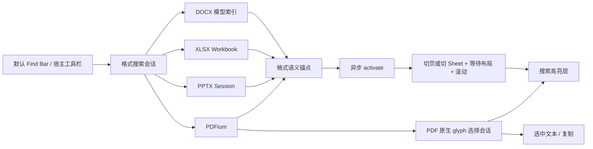

# Surface 搜索与 PDF 文字选择设计

> 状态：首版实现已提交（`cf0a408`）；PDF 拖选与双击选词优化已实现并通过单元、组件及 Chromium 交互验证，待 Firefox/WebKit 矩阵复验
> 适用范围：`packages/vue-docx`、`packages/vue-xlsx`、`packages/vue-pptx`、`packages/vue-pdf`、`packages/vue-ui`
> 取代：`pdf-text-layer-issue.md` 中的透明 `<span>` 文字层方案
> 目标：让四种 Surface 都能搜索并定位结果，让 PDF 在原生文字可用时可靠选择和复制文字

## 1. 结论先行

本设计只解决已经提出的两类能力：

1. DOCX、XLSX、PPTX、PDF 共用搜索会话和 Find Bar，但各格式保留自己的命中锚点。
2. 搜索结果必须能激活、滚入视口并高亮，不能只返回结果数组或只切换页码。
3. DOCX 命中从整行/整块提升为 `DocxTextRange`，精确高亮关键字。
4. XLSX 以单元格为可靠定位单位：切换 Sheet、滚动到单元格并选中；结果摘要可以精确标出关键字。
5. PPTX 复用现有 `searchText()`、`goTo()` 和 `highlightSearchResult()`，把能力下沉给 Surface 使用。
6. PDF 不再使用“透明文字 `<span>` + 浏览器原生 Selection”。搜索与选择统一使用 PDFium 字符索引和 glyph 几何，视觉反馈由矩形覆盖层绘制。
7. PDF 搜索矩形、选择矩形和指针命中必须经过同一坐标变换，避免字体位置和缩放/旋转后的定位偏差。

## 2. 问题与范围

### 2.1 当前问题

| 格式 | 当前能力 | 用户可见缺陷 |
|---|---|---|
| DOCX | `DocxViewer` 能遍历模型查找 | 只能滚动到 node，整段或整块着色，无法精确定位关键字 |
| XLSX | `XlsxToolbar` 能扫描工作簿 | 搜索状态留在 Toolbar；离屏单元格不保证滚入视口；Surface 没有搜索 API |
| PPTX | `PptxViewer` 已有搜索、翻页和形状内高亮 | 能力封装在 Viewer，`PptxStage` 和外部工具栏无法复用 |
| PDF | Runtime 能搜索并返回矩形 | Surface 没有渲染搜索命中；页面为图片，旧 span 文字层会漂移并选错字符 |

### 2.2 本期范围

- DOCX、XLSX、PPTX、PDF 的文档内关键字模糊搜索。
- 结果计数、上一个、下一个、激活、滚动定位和可视高亮。
- Surface 模式和默认 Viewer 模式使用同一个搜索会话。
- PDF 原生文字页的鼠标/触控板拖选、选区显示和文字复制。
- PDF 可见页 geometry 预取、拖动阈值、字符间隙连续命中、逐帧更新和双击选词。
- 搜索输入、空结果、加载状态、关闭和焦点恢复等必要界面交互。
- 异步搜索与定位的竞态处理。

### 2.3 非目标

以下能力没有得到需求确认，不进入本设计：

- OCR、扫描件文字识别以及 OCR Provider。
- PDF 跨页选择、双击选句、三击选行、边缘自动滚动、触屏拖拽手柄和永久高亮。
- 查找替换、正则、大小写开关和整词搜索。
- XLSX 搜索范围切换，以及公式、批注等搜索字段选择。
- 隐藏 Sheet、隐藏行列、隐藏幻灯片和播放模式的特殊搜索规则；首版沿用现有文档模型的可搜索内容，不在本设计新增产品语义。
- 可配置结果上限、截断结果展示和固定缓存/并发/批处理参数；如性能测试证明需要，另行设计。
- 修复 PDF 文件本身错误的阅读顺序、逻辑结构或 Unicode 映射。

DOCX 首版搜索当前模型可以稳定表达位置的正文和表格段落。页眉页脚、脚注/尾注、文本框和不可表达的嵌套结构，待模型锚点具备后再接入。

XLSX 不在只读网格内部伪造字符级 DOM 高亮；单元格选中是主定位反馈，关键字精确高亮显示在 Find Bar 结果摘要或已有详情区域。

## 3. 设计原则

1. **语义锚点先于视觉坐标**：先保存模型位置，再投影到当前布局；分页、缩放和虚拟化后可以重算。
2. **单一状态源**：查询、结果和当前索引只由 Surface 搜索会话维护。
3. **定位是异步事务**：跨页、跨 Sheet 和虚拟化场景必须等待目标布局完成。
4. **高亮不参与排版**：高亮层不能改变字体 shaping、行宽、分页或网格尺寸。
5. **能力失败要明确**：无法提取文字或无法定位时显示失败，不把错误字符伪装成成功结果。
6. **公共合同保持最小**：只定义四格式当前都需要的搜索行为，不提前加入可选搜索模式。

## 4. 总体架构



`Viewer` 是默认界面的组合层。默认 Find Bar 和宿主工具栏都通过 Surface 调用同一个搜索 API，并监听同一个状态事件，不能分别维护结果。

## 5. 最小统一搜索合同

### 5.1 公共状态与 API

公共类型放到 `packages/office-runtime`，Find Bar 放到 `packages/vue-ui`。公共层不依赖具体格式的模型类型。

```ts
export type SurfaceSearchStatus = "idle" | "searching" | "ready" | "error"

export interface SurfaceSearchState<M> {
  status: SurfaceSearchStatus
  query: string
  matches: readonly M[]
  activeIndex: number // 无当前结果时为 -1
  error?: { code: string; message: string }
}

export interface SurfaceSearchApi<M> {
  search(query: string): Promise<SurfaceSearchState<M>>
  activateSearchMatch(index: number): Promise<void>
  searchNext(): Promise<void>
  searchPrevious(): Promise<void>
  clearSearch(): void
  getSearchState(): SurfaceSearchState<M>
}
```

所有 Surface expose 上述方法，并发送：

```ts
emit("searchStateChange", state)
```

公共行为：

- `search("")` 等价于 `clearSearch()`，不扫描文档。
- 新查询使旧查询及旧定位失效，旧任务不得覆盖最新状态或把视口拉回去。
- 搜索完成后默认激活第一条结果。
- next/previous 循环导航；无结果时不改变滚动位置。
- 越界激活和布局定位失败进入 `error`，不伪造成功的 `activeIndex`。
- 请求标识和取消控制属于会话内部实现，不进入公共状态和调用参数。

### 5.2 格式命中锚点

```ts
export interface DocxSearchMatch {
  kind: "docx-text"
  range: DocxTextRange
  pageIndex?: number
  before: string
  match: string
  after: string
}

export interface XlsxSearchMatch {
  kind: "xlsx-cell"
  workbookSheetIndex: number
  sheetName: string
  cell: XlsxCellAddress
  start: number
  end: number
  text: string
}

export interface PptxSearchMatch {
  kind: "pptx-text"
  slideIndex: number
  nodeId: string
  matchStart: number
  matchEnd: number
  before: string
  match: string
  after: string
}

export interface PdfPageTextSlice {
  pageIndex: number
  charIndex: number
  charCount: number
}

export interface PdfSearchMatch {
  kind: "pdf-text"
  range: PdfPageTextSlice
  rects: readonly PdfRenderRect[]
  before: string
  match: string
  after: string
}
```

模型锚点是事实来源，`pageIndex` 和 `rects` 是当前布局缓存。分页、缩放、旋转或 Sheet 尺寸改变后，不能直接复用旧矩形。

### 5.3 匹配语义

- 首版默认模糊搜索，定义为大小写不敏感的连续子串包含匹配，不提供搜索模式开关。
- “模糊”不包含错别字纠正、编辑距离、拼音、同义词或语义召回；这些能力没有需求依据，也不能保证四种格式结果一致。
- `start/end` 和 DOCX/PPTX offset 使用 UTF-16 code unit，start inclusive/end exclusive，与 DOM Range 和 `String#indexOf` 一致。
- DOCX 搜索可表达位置的正文和表格段落；PPTX、PDF 搜索当前文档；XLSX 沿用现有 workbook 搜索的文字来源。本设计不新增范围或字段切换。
- 结果排序稳定：文档、页或幻灯片顺序；XLSX 按 Sheet、行、列顺序。

## 6. Find Bar 与定位交互

### 6.1 `OfficeFindBar`

Find Bar 只显示状态并发出用户操作，不持有另一份搜索结果。

```ts
interface OfficeFindBarProps {
  query: string
  status: SurfaceSearchStatus
  activeIndex: number
  resultCount: number
  placeholder?: string
}

interface OfficeFindBarEmits {
  "update:query": [query: string]
  next: []
  previous: []
  close: []
}
```

必要交互：

- 当焦点位于 Viewer/Surface 内时，`Ctrl+F` / `Cmd+F` 打开并聚焦 Find Bar；不永久劫持全局浏览器查找。
- IME 组合输入期间不搜索，`compositionend` 后提交最终查询；普通输入采用可调整的短延迟合并请求，不把具体毫秒数写成架构合同。
- Enter 到下一条，Shift+Enter 到上一条，Esc 关闭、清除搜索高亮并把焦点还给原 Surface。
- 显示搜索中、当前序号/总数和空结果状态。
- 当前命中与其他可见命中使用可区分的样式；按钮有可读标签和可见焦点状态。
- 当前结果已经完全可见时不滚动；不可见时滚入视口。定位不能改变用户 zoom。

### 6.2 激活事务

所有格式按同一顺序激活：

1. 校验结果索引和当前搜索会话。
2. 切换页、幻灯片或工作表。
3. 等待目标布局和虚拟节点挂载。
4. 从语义锚点计算当前布局矩形。
5. 如果目标不可见，将其滚入视口。
6. 更新当前高亮和搜索状态。

任何一步被更新的查询或导航取代，都必须停止提交旧结果。

## 7. DOCX 精确搜索

### 7.1 模型索引

当前 `DocxViewer` 的 `nodeText()` 会把表格拍平，结果只有 `{ nodeIndex, offset }`。新实现按可渲染段落建立索引：

```ts
interface DocxSearchSegment {
  location: DocxTextRangeLocation
  text: string
  pageIndex?: number
}
```

- 正文段落位置为 `{ kind: "paragraph", nodeIndex }`。
- 表格段落位置为 `{ kind: "table-cell", tableIndex, rowIndex, cellIndex, paragraphIndex }`。
- 命中生成同一 location 下的 `DocxTextRange` start/end；文字 run 不构成搜索边界，因此允许跨 run 命中。
- 搜索文本来自与当前视图一致的可见文字投影，避免模型 offset 无法映射到 DOM。
- 首版不跨段落匹配短语。
- range offset 与 DOM 映射统一使用 UTF-16 code unit。

### 7.2 DOM 投影与高亮

渲染器为每个段落维护“模型 offset → DOM Text node/offset”映射。目标段落挂载后，把 `DocxTextRange` 投影为 DOM `Range`。

高亮策略：

1. 通过兼容验证的浏览器使用 CSS Custom Highlight，避免修改 DOM 和分页。
2. 不支持或渲染异常时，使用 `Range.getClientRects()` 生成绝对定位矩形。
3. 不向 `v-html` 注入 `<mark>`；这会破坏 selection、评论/修订 offset 和分页测量。

WebKit 已存在 CSS Custom Highlight 与 flex、`user-select:none` 组合下的公开缺陷，因此必须保留 rect fallback，不能只做 API 存在性判断。

### 7.3 激活

- 先根据 range 定位页面并请求虚拟化挂载，再创建 DOM Range。
- 同一段的多个结果分别建立 Range，只有当前 Range 使用 active 样式。
- 分页、zoom、字体加载或文字投影改变后，使矩形缓存失效并重新投影。

## 8. XLSX 搜索与定位

将 `XlsxToolbar` 内的查询和结果下沉到 workbook controller 或独立 `useXlsxSearch(controller)`；Toolbar 只渲染 `OfficeFindBar`。

`XlsxGrid` / `XlsxSheetSurface` 提供：

```ts
scrollToCell(
  cell: XlsxCellAddress,
  options?: { block?: "center" | "nearest" },
): Promise<void>
```

激活顺序：

1. 根据 `workbookSheetIndex` 激活目标 Sheet。
2. 等待工作表模型、行列尺寸和 Grid 挂载。
3. 将合并单元格地址归一到左上 anchor。
4. 调用 `scrollToCell()`。
5. 调用 `selectCell()`。

当前实现只切 Sheet 和选择单元格，没有确保离屏目标滚入视口，因此必须补齐等待和滚动步骤。

Grid 使用选中单元格边框作为主定位反馈。`XlsxSearchMatch.text/start/end` 由现有搜索结果提供，用于结果摘要中的关键字着色，不要求在网格内拆分文字高亮。

## 9. PPTX 搜索与定位

现有主链是 `session.searchText()` → `goTo(slideIndex)` → `session.highlightSearchResult()`。本期不重写算法，只下沉能力：

- 使用独立搜索会话，`PptxViewer`、`PptxStage` 和宿主工具栏共享状态。
- 沿用 `slideIndex/nodeId/matchStart/matchEnd`，不退化成整页高亮。
- `goTo()` 后等待目标 slide 挂载，再调用形状内高亮。
- 同一 shape 多次出现分别计数和导航；新查询清除旧高亮。
- 隐藏页和播放模式继续沿用现有 session/Viewer 行为，本设计不新增规则。

## 10. PDF 搜索与原生文字选择

### 10.1 为什么旧文字层不可靠

旧实现根据 `getPageTextRects()` 创建透明 `<span>`，存在三个问题：

1. 上游 geometry 已是左上角原点的 device space；旧实现再次翻转 Y，导致坐标错误。
2. 浏览器会使用可用字体重新 shaping 透明文字，替代字体的字宽、kerning、ligature 与 PDF glyph advance 不一致，选区会逐字符漂移。
3. CID 字体缺少或错误 ToUnicode 时，PDFium 无法得到正确 Unicode；调整 CSS、字体或 span 宽度不能恢复原文。

因此不能继续调 span 方案，必须直接使用 PDFium 字符索引与 glyph 几何。

### 10.2 Runtime 数据接口

```ts
interface PdfPageTextGeometry {
  pageIndex: number
  geometry: PdfPageGeometry
}

interface PdfSelectionState {
  kind: "none" | "text"
  range?: PdfPageTextSlice
  text?: string
  rects?: readonly PdfRenderRect[]
}

getPageTextGeometry(
  document: PdfDocument,
  pageIndex: number,
): Promise<PdfPageTextGeometry>

getTextSlice(
  document: PdfDocument,
  slice: PdfPageTextSlice,
): Promise<string>
```

`@embedpdf` 当前版本已经暴露 `getPageGeometry()` 和 `getTextSlices()`，selection 插件提供 `glyphAt()` 与 `rectsWithinSlice()`。优先复用这些纯函数。若运行时代码直接引入 selection 插件，必须确保发布包能解析该 runtime dependency，并增加 package tarball 测试。

### 10.3 唯一坐标管线

定义 `getPageGeometry()` 返回的“未缩放、旋转参数为 0、左上角为原点”的 page device space 为 canonical space，宽高为 `W/H`。geometry、搜索矩形和选择矩形都由 Runtime 适配到这个空间。

`intrinsicRotation` 来自页面，`userRotation` 来自 Surface；总旋转 `q = ((intrinsicRotation + userRotation) / 90) mod 4`。canonical rect `(x,y,w,h)` 到未缩放显示 rect 的矩阵为：

| q | 显示尺寸 | rect `(X,Y,width,height)` |
|---|---|---|
| 0 | `W × H` | `(x, y, w, h)` |
| 1 / 90° | `H × W` | `(H - y - h, x, h, w)` |
| 2 / 180° | `W × H` | `(W - x - w, H - y - h, w, h)` |
| 3 / 270° | `H × W` | `(y, W - x - w, h, w)` |

指针坐标先转为 page slot 内的 CSS 坐标，再除以 zoom，并按总旋转逆变换到 canonical point，最后调用 `glyphAt()`。

```text
client point
  -> page slot local CSS point
  -> divide by zoom
  -> inverse(total rotation)
  -> canonical page point
  -> glyphAt(pageGeometry)

canonical rect
  -> total rotation
  -> multiply by zoom
  -> page overlay CSS rect
```

页面图片、搜索高亮、选择高亮和 pointer hit-test 必须调用同一个 transform 模块。组件不得各自实现 Y 翻转或旋转逻辑，glyph 几何不乘 devicePixelRatio。

PDFium 要求页面/设备坐标转换使用与渲染相同的起点、尺寸和旋转参数。本项目必须用带页面自身旋转的 fixture 固化 Runtime 和 Surface 对 total rotation 的处理。

### 10.4 基础选择状态机

本期只实现单页内的基础拖选：

- `pointerdown`：在页面 interaction layer 捕获指针，将坐标转换到 canonical space，并用 `glyphAt()` 建立 anchor。
- `pointermove`：在同一页更新 focus，根据字符范围调用 `rectsWithinSlice()` 生成选区矩形；支持同页跨行和反向拖动。
- `pointerup`：固化 `PdfPageTextSlice`，读取所选文字并更新 `PdfSelectionState`。
- `Ctrl/Cmd+C`：Surface 有焦点且存在选区时复制当前已解析的文字。
- 点击空白或 Escape：清除当前选区。

选区矩形只负责视觉显示，使用 `pointer-events: none`；interaction layer 负责指针事件，避免高亮阻断滚动。

### 10.5 搜索与选择共用覆盖层

每个 PDF page slot 的顺序为：

1. raster image；
2. 普通搜索命中；
3. 当前搜索命中；
4. 用户选择；
5. 透明 interaction layer。

PDF 搜索结果必须透传上游已有的 `charIndex/charCount`，不能根据 context 字符串反推字符位置。激活结果时先挂载并滚动到目标页，再滚动到当前命中矩形，而不是只切换页码。

### 10.6 拖选与双击选词优化（已实现）

本轮只改善现有文字页的选择交互，不改变单页选择边界和公开 `PdfSelectionState`。

#### 10.6.1 拖选

- 文档打开和中心可见页变化后预取当前页及相邻页 geometry，并对同页请求去重；文档更换后旧请求不能写入新缓存。预取只降低延迟，不能成为正确性前提。
- `pointerdown` 先同步保存 down/latest point，再异步读取 geometry。移动超过内部阈值才建立选区；未超过阈值的单击只清除选区。即使抬起时 geometry 尚未返回，也要用已保存的 down/up point 完成选区。
- focus 优先使用 `glyphAt()`；未命中但仍位于文字 run 内时吸附到该 run 最近的非 empty glyph，离开文字 run 时保持最后 focus，避免跨行或跨栏跳选。
- `pointermove` 每帧只处理最新位置，focus 改变时才调用 `rectsWithinSlice()`；`pointerup` 提交前同步处理最终位置。
- 新手势、`pointercancel`、文档更换或卸载必须使旧异步任务和待执行 frame 失效。

#### 10.6.2 双击选词

- 使用浏览器 click count 识别双击，只实现选词，不自行定义双击时间。
- `glyphAt()` 确定 PDF charIndex，`expandToWordBoundary()` 给出粗范围；对范围内字符按需读取单字符 slice，建立 PDF charIndex 与 UTF-16 offset 的映射，再用 `Intl.Segmenter` 得到词边界并映射回 glyph 范围。
- 不能直接把 JS string offset 当作 PDF charIndex；代理对、组合字符或一个 glyph 对应多个 code unit 时，边界向外取整到完整 glyph。
- 继续使用 `@embedpdf/plugin-selection` 根出口的公开纯函数，不深层导入内部 handler，不增加第三方分词依赖或新的公开 API。

## 11. 性能、错误与竞态

- 搜索会话内部为查询和激活维护最新任务标识；输入合并不能代替旧任务失效处理。
- DOCX 全文保存轻量模型锚点，只为已经挂载的页面创建 DOM Range 或矩形。
- PDF geometry 按可见页和少量 overscan 懒加载；具体缓存上限由性能测试决定，不写入公共合同。
- XLSX 可复用现有 Worker 扫描大工作簿；批次大小和是否限制结果数由基准测试后决定。
- PPTX 复用 session 索引，避免每次输入重新解析页面 XML。
- 文档 identity 更换时，旧结果、高亮、PDF 选区和 pending activation 必须一起清空。
- 对外至少区分搜索失败、定位失败和 PDF 文字不可用；不为未实现的搜索模式或 OCR 定义错误码。

## 12. 验收矩阵

### 12.1 公共交互

- `Ctrl/Cmd+F` 只在当前 Viewer/Surface 范围内接管，关闭后焦点返回原 Surface。
- IME 组合期间不触发中间查询；连续输入只提交最终查询。
- Enter/Shift+Enter 循环导航；0 条结果不改变滚动位置。
- 目标已经可见时不滚动；不可见时滚入视口且不改变 zoom。
- 查询或 next/previous 快速连续触发时，旧任务不能覆盖当前结果或拉回视口。
- Find Bar 的输入框、上一条、下一条和关闭按钮可通过键盘操作，并有可见焦点状态。

### 12.2 DOCX

- 同段多命中和跨 run 命中可以逐条精确高亮。
- 中文、emoji/代理对和表格单元格的 offset 映射正确。
- 分页、zoom 和字体加载后，Range 仍对应原关键字。
- CSS Highlight 与 rect fallback 都有真实浏览器测试；离屏结果先挂载再高亮。

### 12.3 XLSX

- 当前 Sheet、跨 Sheet 和离屏单元格都能定位。
- 激活后目标 Sheet 正确、目标单元格进入视口并被选中。
- 合并单元格定位到左上 anchor；结果摘要高亮正确的关键字范围。

### 12.4 PPTX

- 同一 shape 多命中和多个 shape 可以逐条定位。
- 离屏虚拟 slide 先挂载，再精确高亮 shape 内关键字。
- 新查询清除旧高亮；快速导航不被旧 activation 拉回。

### 12.5 PDF

首版既有验收：

- 在项目支持的 zoom 和 0/90/180/270 旋转下，搜索与选择矩形仍贴合目标 glyph。
- 中英文、ligature、RTL、竖排、多栏和同页跨行选择使用 PDFium 的字符顺序和 geometry 验证。
- 单页内正向和反向拖选得到相同的文字范围，复制文本与可视选区一致。
- search geometry 和 selection geometry 都通过同一个 canonical transform。

拖选与双击选词新增验收：

- 使用可控延迟 geometry 的 fixture，在 down/move/up 都早于 geometry 返回时，最终范围仍使用原始 down point 和最后 up point。
- 移动未超过阈值时不产生单字符选区；进入拖选后，字符间隙处连续推进且不跳到相邻行或栏。
- 高频 pointermove 每帧最多提交一次，focus 不变时不重算，pointerup 不遗漏最终位置。
- 双击英文单词、数字和固定中文词样本时，视觉范围与复制文字一致。
- 复用已有 zoom/rotation fixture，并进入项目现有的 Chromium、Firefox、WebKit 矩阵。

视觉定位使用固定 PDF/DOCX fixture 和截图或矩形断言；交互测试同时检查滚动位置、active anchor 和实际复制文本，不能只检查数组长度或 DOM 节点存在。

## 13. 实施顺序

| 阶段 | 内容 | 退出条件 |
|---|---|---|
| 1. 公共基础 | 最小搜索 API、搜索会话、`OfficeFindBar`、竞态处理 | 四个 demo 能用同一 Find Bar 驱动 mock adapter |
| 2. 接通已有搜索 | PPTX 会话下沉、XLSX `scrollToCell`、PDF 搜索 overlay | 三种格式可搜索、激活并滚动到结果 |
| 3. DOCX 精确 range | 模型索引、DOM offset map、CSS Highlight + rect fallback | 同段多命中和表格结果可逐条精确高亮 |
| 4. PDF 原生 glyph 选择 | Runtime geometry/text slice、统一 transform、基础指针状态机和复制 | zoom/rotation、单页跨行和反向拖选 fixture 通过 |
| 5. PDF 选择交互优化 | geometry 预取、拖动阈值、run 内吸附、逐帧更新、双击选词 | 首拖不丢、单击不误选、拖选连续、双击词边界和三浏览器测试通过 |

阶段 4 必须先完成坐标 transform 单元测试和带页面自身旋转的 PDF fixture。阶段 5 只改善现有文字页交互，非目标仍以 2.3 节为准。

## 14. 外部研究验证

以下研究只验证本期采用的技术路线，不作为增加产品需求的依据：

| 设计判断 | 官方依据 | 结论 |
|---|---|---|
| PDF 按字符索引和字符框选择 | PDFium `FPDFText_CountChars/GetUnicode/GetCharBox/GetLooseCharBox/HasUnicodeMapError` | 可行；字符索引与 glyph 框是可靠锚点，错误 Unicode 不能由 UI 猜测修复 |
| 坐标转换与渲染参数一致 | PDFium `FPDF_PageToDevice/FPDF_DeviceToPage` | 必须集中 transform，旧方案的二次 Y 翻转不可靠 |
| geometry 矩形选区是成熟路径 | EmbedPDF Selection Plugin | 可复用现有 geometry、hit-test 和 range rect 纯函数，无需透明 span |
| 拖选和双击事件语义 | W3C Pointer Events | 使用 pointer capture、浏览器 click count 和每帧最终位置；异步 geometry 期间由应用保留手势状态 |
| 拖动阈值和选词已有上游先例 | 本地锁定 `@embedpdf/plugin-selection@2.14.4` | 复用公开纯函数并沿用交互语义，不深层导入内部 handler |
| locale-sensitive 词边界 | ECMA-402 `Intl.Segmenter` 与 Unicode UAX #29 | 英文/数字路径成熟；中文等语言需要 locale tailoring 和固定 fixture，不能只按空格切词 |
| DOCX 用 Range 高亮且不修改 DOM | W3C CSS Custom Highlight API | 适合跨 run Range |
| CSS Highlight 不能是唯一实现 | WebKit 已公开 flex 与 `user-select:none` 相关缺陷 | 必须保留 rect fallback |
| XLSX 搜索结果定位到单元格 | Microsoft Excel Find | 符合办公软件的网格定位语义 |
| Find Bar 包含计数和上下条 | Microsoft Word/Excel Find | 符合常见查找交互 |

参考链接：

- [PDFium text API](https://pdfium.googlesource.com/pdfium/+/main/public/fpdf_text.h)
- [PDFium page/device coordinate API](https://pdfium.googlesource.com/pdfium/+/main/public/fpdfview.h)
- [EmbedPDF Vue Selection Plugin](https://www.embedpdf.com/docs/vue/headless/plugins/plugin-selection)
- [EmbedPDF Selection Plugin 源码](https://github.com/embedpdf/embed-pdf-viewer/tree/main/packages/plugin-selection)
- [W3C Pointer Events](https://www.w3.org/TR/pointerevents/)
- [ECMA-402 Intl.Segmenter](https://tc39.es/ecma402/#sec-segmenter-objects)
- [Unicode UAX #29：Text Segmentation](https://www.unicode.org/reports/tr29/)
- [W3C CSS Custom Highlight API](https://www.w3.org/TR/css-highlight-api-1/)
- [WebKit bug 307455：Custom Highlight 与 flex](https://bugs.webkit.org/show_bug.cgi?id=307455)
- [WebKit bug 278455：Custom Highlight 与 user-select:none](https://bugs.webkit.org/show_bug.cgi?id=278455)
- [Microsoft Word：Find text in a document](https://support.microsoft.com/en-us/word/find-text-in-a-document)
- [Microsoft Excel：Find or replace text and numbers](https://support.microsoft.com/en-us/excel/get-started/find-or-replace-text-and-numbers-on-a-worksheet)

可靠性判断：

- **高置信度**：统一搜索会话、XLSX 单元格定位、PPTX 能力下沉和 PDF glyph 矩形选择，都有当前代码或上游能力支撑。
- **PDF 交互优化**：首拖、阈值、逐帧更新及英文/数字选词置信度高；中文词边界以固定 fixture 验收，不对语言学歧义作无限承诺。
- **需要兼容层**：DOCX CSS Custom Highlight 的方向可靠，但 WebKit 缺陷决定了 rect fallback 必须保留。
- **明确限制**：PDF glyph geometry 能解决定位错误，不能修复文件自身的错误 Unicode 映射；本期对此明确失败，不扩展到 OCR。
- **明确否决**：透明 span/native Selection 会让浏览器重新排版 PDF 文字，无法同时保证坐标、字宽和字符映射。

## 15. 文档关系

- `unified-surface-api-design.md` 定义 Surface 边界、通用事件和 expose 命名；搜索与 PDF 选择以本文为准。
- `pdf-text-layer-issue.md` 仅作为历史问题记录，不再作为实现计划。
- `docx-viewer-controlled-surface-and-pagination-fix.md` 中未实现的搜索 props/update/expose 方案已经撤回；该文档只负责非搜索的分页与受控状态设计。
